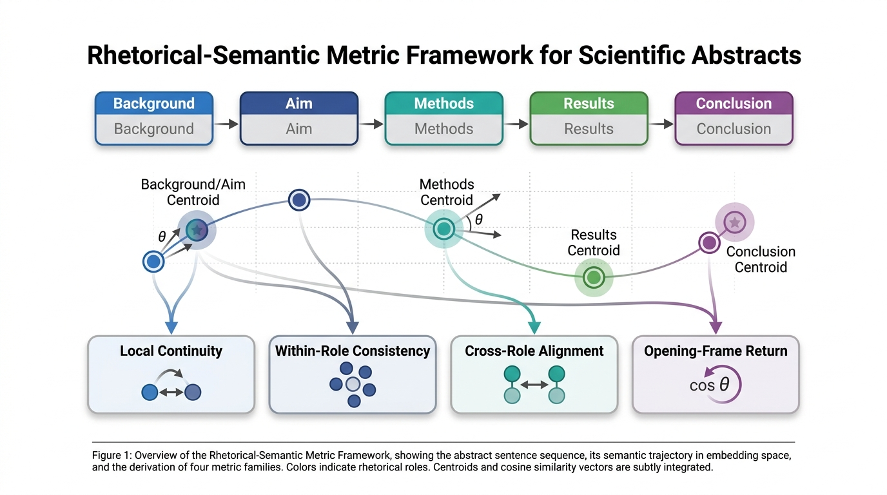

# Rhetorical-Semantic Metrics for Scientific Abstracts

This repository contains code for building a PubMed pilot corpus and computing **role-aware rhetorical-semantic metrics** for scientific abstracts. It accompanies the manuscript project:

**Measuring Scientific Narrative Coherence: A Rhetorical-Semantic Metric Framework for Research Abstracts**

The framework treats abstracts as structured semantic trajectories rather than as undifferentiated text sequences. Sentences are assigned rhetorical roles, embedded in semantic space, and analyzed using local, within-role, and cross-role similarity metrics.



## What the pipeline does

1. Queries PubMed for periodontal-disease candidate abstracts.
2. Builds two candidate datasets:
   - systematic reviews/meta-analyses
   - clinical studies
3. Splits each abstract into sentences with spaCy.
4. Uses an OpenAI model to assign one rhetorical role to each sentence:
   - Background
   - Aim
   - Methods
   - Results
   - Conclusion
   - Limitation/Future
5. Encodes sentences using a sentence-transformer model.
6. Computes sentence-level and abstract-level rhetorical-semantic metrics.
7. Retains the first 50 successfully processed abstracts per group.
8. Exports reproducible tables and figures.

## Repository structure

```text
rhetorical-semantic-metrics/
├── config.yaml
├── requirements.txt
├── pyproject.toml
├── README.md
├── CITATION.cff
├── rsm/
│   ├── __init__.py
│   ├── pubmed.py
│   ├── labeling.py
│   ├── metrics.py
│   └── analysis.py
├── scripts/
│   ├── build_pubmed_datasets.py
│   └── run_analysis.py
├── data/
│   ├── raw/          # generated PubMed candidate datasets; ignored by git
│   ├── processed/    # optional processed files; ignored by git
│   └── frozen/       # manuscript-level non-text outputs / PMID lists
├── docs/
│   └── figures/      # paper figures
└── outputs/          # generated analysis outputs; ignored by git
```

## Installation

```bash
git clone https://github.com/YOUR-USERNAME/rhetorical-semantic-metrics.git
cd rhetorical-semantic-metrics
pip install -r requirements.txt
python -m spacy download en_core_web_sm
```

The package requires Python 3.10 or later.

## Configuration

Edit `config.yaml` before running. At minimum, set a real NCBI email address:

```yaml
pubmed:
  email: your.real.email@example.com
```

Set your OpenAI API key as an environment variable:

```bash
export OPENAI_API_KEY="your_api_key"
```

In Colab:

```python
import os
from getpass import getpass
os.environ["OPENAI_API_KEY"] = getpass("OpenAI API key: ")
```

Default manuscript configuration:

```yaml
pubmed:
  candidates_per_group: 200
  target_successful_per_group: 50
models:
  llm_model: gpt-5.4-mini
  embedding_model: all-MiniLM-L6-v2
analysis:
  min_sentences: 5
  required_roles:
    - Methods
    - Results
```

## Step 1: Build PubMed candidate datasets

```bash
python scripts/build_pubmed_datasets.py
```

This creates candidate datasets in `data/raw/`, including:

```text
data/raw/periodontal_reviews_vs_clinical_candidates.csv
```

The review query is restricted by default to systematic reviews and meta-analyses. This design choice is intentional: the main metrics require identifiable Methods and Results components.

## Step 2: Run rhetorical-semantic analysis

```bash
python scripts/run_analysis.py
```

The analysis stops when it reaches the target number of successfully processed abstracts per group. By default, this is 50 review abstracts and 50 clinical-study abstracts.

Outputs include:

```text
outputs/all_sentence_level_metrics.csv
outputs/all_abstract_level_metrics.csv
outputs/review_errors.csv
outputs/clinical_errors.csv
outputs/tables/dataset_level_metric_summary_mean_sd_sem.csv
outputs/tables/table_mean_sd_reviews_vs_clinical.csv
outputs/tables/statistical_comparison_reviews_vs_clinical.csv
outputs/tables/statistical_comparison_sorted_by_effect_size.csv
outputs/figures/figure2_local_vs_role_aware_metrics.png
outputs/figures/figureS1_rhetorical_role_composition.png
```

## Main metric families

### Local semantic continuity

Adjacent-sentence cosine similarity. This captures local sentence-to-sentence semantic flow.

### Local discontinuity burden

The proportion of transitions falling below an abstract-specific low-similarity threshold, defined as:

```text
mean local similarity - 1 standard deviation
```

### Within-role semantic consistency

Mean pairwise similarity among sentences assigned to the same rhetorical role. This is computed only when a role has at least two sentences.

### Leave-one-out role-anchor similarity

Sentence-to-role consistency computed by comparing each sentence with the centroid of the other sentences in the same role. This avoids self-inflation.

### Cross-role alignment

Similarity between rhetorical-role centroids. Principal metrics include:

- Conclusion-to-Aim alignment: rhetorical closure
- Conclusion-to-Results alignment: interpretive grounding
- Results-to-Methods alignment: evidential linkage
- Methods-to-Aim alignment
- Results-to-Aim alignment
- Conclusion-to-Background/Aim alignment
- Conclusion/Limitation-Future-to-Background/Aim alignment

### Opening-frame return

The mean similarity between the opening centroid, defined from Background and Aim sentences, and the last two sentences of the abstract.

## Included manuscript-level files

The repository includes non-text manuscript-level outputs in `data/frozen/`, including analyzed PMIDs/titles and abstract-level metrics. Raw PubMed abstracts are not committed by default because PubMed results may change over time and abstract redistribution may be subject to licensing restrictions.

For exact reproducibility, rerun the PubMed query with the reported configuration or archive the generated raw candidate CSV files separately when licensing permits.

## Interpretation

The code does **not** assess scientific quality, methodological validity, novelty, or clinical relevance. The metrics are descriptive indicators of rhetorical-semantic organization. High or low similarity values require contextual interpretation and should not be treated as automatic quality scores.

## Validation status

The current repository implements the analysis pipeline used for the pilot study. Future work should evaluate agreement between LLM-generated rhetorical-role labels and expert human annotations, and should assess robustness across domains, article types, and embedding models.

## Citation

If you use this code, cite the associated paper once published. A `CITATION.cff` file is included for software citation metadata.
